### 1. Request Lastpass Access
#### Follow these steps if you don't already have access to the company's Lastpass account. If you are new to OIT, you most likely don't.

Later in this tutorial, you are going to need to get an access key from the company's Lastpass account. To be able to log in to this account and get the Key, you will need to submit a request for a company Lastpass account. LastPass access requires supervisor approval, so your supervisor will receive an email to authorize your access. After that approval is received, you should receive an activation email within three hours.

Follow [this link](https://it.byu.edu/it?id=sc_cat_item&sys_id=021710700f3fc300f431db0be1050ead) to an order form and fill it out (You can put 'Mark Crowther' as the manager).

### 2. Setup Steps

You're going to need to paste some files into the '.ssh' folder on your home directory. If you're unfamiliar with that terminology, your 'home directory' is the home folder for your user data. It is the root of /Downloads, /Documents, etc. If you are on windows, one quick way to get to your root directory is by entering `%HOMEPATH%` into the directory of File Explorer, and then hit 'Enter', as shown below:
 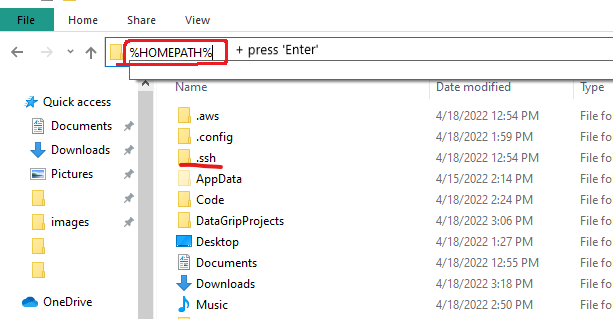

If there is not already a folder there named `.ssh`, then create one. Don't forget to include the `.`.

#### Mac or Linux

 

If you are on Mac or Linux:

1. Copy from [this repository](https://github.com/byu-oit/ces-bastions/tree/main/.ssh) the content of `.ssh/config-unix`.
3. If there is a `config` file in your `.ssh` directory then open it and
   append the copied content to the file. If there is no `config` file
   there then create it and paste the copied content.

#### Windows

1. Copy from [this repository](https://github.com/byu-oit/ces-bastions/tree/main/.ssh) the content of `.ssh/config-windows`.
2. If there is a `config` file in your `.ssh` directory then open it and
   append the copied content to the file. If there is no `config` file
   there then create it and paste the copied content.

### DataGrip Installation and Configuration

DataGrip is an IDE for databases and will make it easy to interact with
and query your databases.

1. Install JetBrains DataGrip using one of the methods below:

   a.
   [Install JetBrains Toolbox](https://www.jetbrains.com/toolbox-app/)
   and install DataGrip from there.

   b.
   [Install DataGrip](https://www.jetbrains.com/help/datagrip/installation-guide.html)
   only.

2. Open Datagrip, and then install the Settings Repository Plugin. You can select the 'Plugins' tab from the Datagrip launcher and search for 'Settings Repository'.
 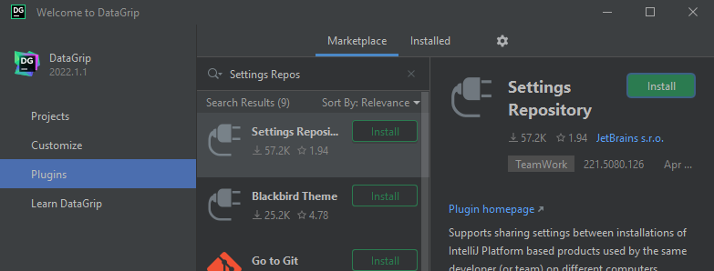
   1. Click the 'Install' button. 
   2. Now we need to configure it. First, open up the settings from the launcher:
       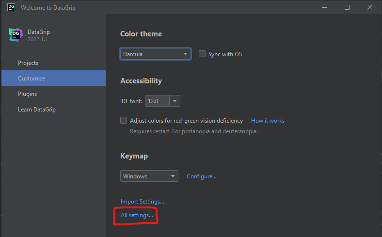
   3. Navigate to the plugin settings `Tools > Settings Repository`, then disable auto synchronization and disable the option to include the computer hostname from commit messages (uncheck both of the boxes in the below screenshot). Then click 'Apply'.
       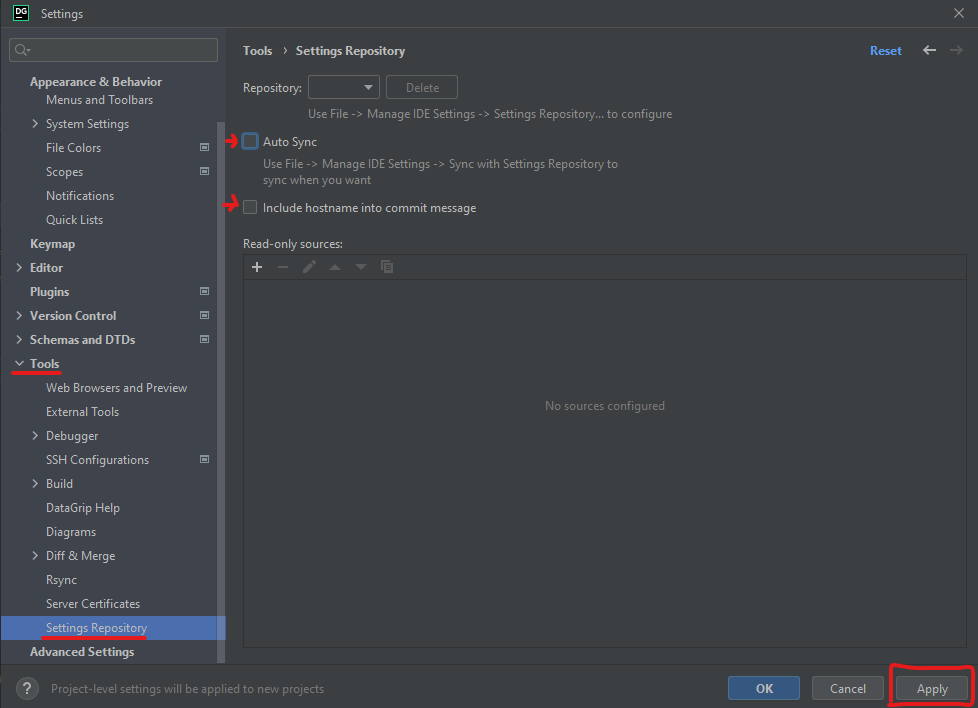
3. You'll need to make a new project now. It doesn't matter what you call it.
    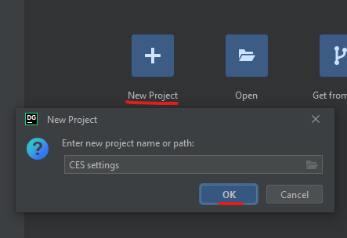
4. Before the next step, you'll need to make a GitHub Access Token
   1. Click on [this link](https://github.com/settings/tokens) to go to the Personal Access Tokens settings page in github.
   2. Click 'Generate New Token' to make your token.
    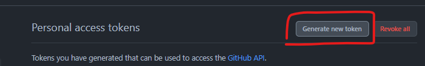
   3. Call it whatever you want in the 'Note' field, what you put here doesn't matter.
   4. You can leave the default expiration date. This token will only be used this one time to access the repository to load the database connection settings, and then it won't be used anymore, so it doesn't matter if it expires soon.
   5. Give the token access to the repo, as shown below. That is the only box you need to check.
       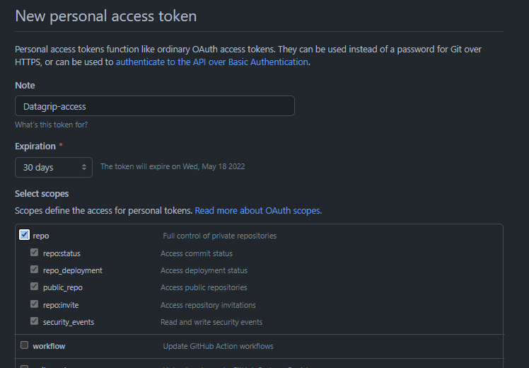
      1. Scroll down and select 'Generate token' 
          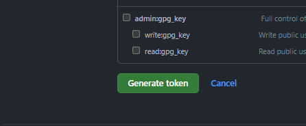
   6. **Before you do anything else**, make sure to copy the token that appears now
       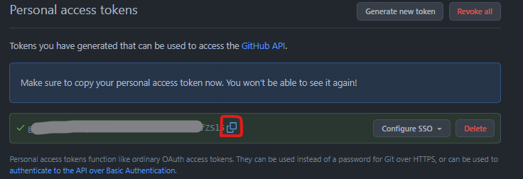
   7. Paste it in a secure location, somewhere that you can copy from later if you accidentally overwrite or erase your clipboard. After the next step, you won't be able to copy your token again!
   8. Authorize your token by clicking on the buttons shown below. You'll have to log in to BYU and/or click 'Authorize' once or twice before you are redirected.
    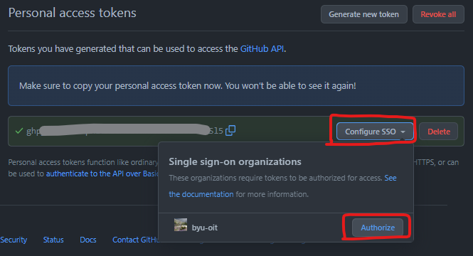
5. Go back to Datagrip. Navigate to `File > Manage IDE Settings > Settings Repository`
    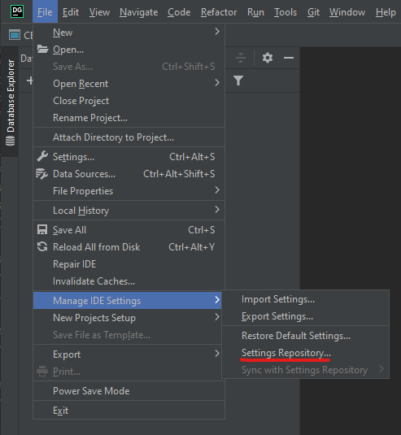
6. Paste in this url into the box that appears: `https://github.com/byu-oit/ces-datagrip-settings`. Then click 'Overwrite Local'
 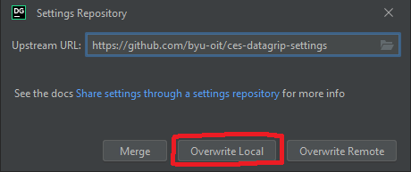
7. Paste in your access token. It might still be in your clipboard, but if not then copy it again from the place you put it previously. If for some reason you lost it and still don't have it, just make a new one. Feel free to delete the old one.
 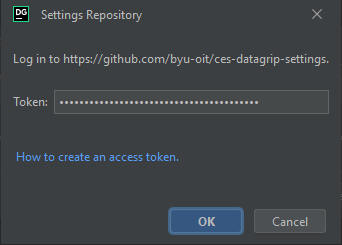
8. Your datagrip should look like this now. However, none of the connections will work. We still need to get credentials and finish the SSH configuration.
 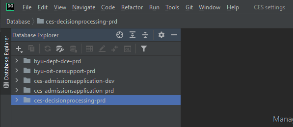

### Load the Public Key from Lastpass

Hopefully by now you have access to the oit lastpass. 
Locate the SSH credentials in LastPass under the `Shared-Application Development\CESGI` folder. Download and save the `CES Bastion SSH Credentials` private key in your user `.ssh` directory as a file called `ces.key`. Yes, `.key` should be the file extension, but edit it as a text file. If you rename or relocate this key, you may need to adjust the private key file selection in the ssh configuration mentioned in the next step.

### Connect!

First, Restart DataGrip to load the new configurations.

Then to actually access the databases that have been added to your Datagrip you will need to have access to the aws-accounts that correspond to the folder names. The folders are the ones with names like 'byu-oit-cessupport-prd'. Inside each folder you will see a handful of database connections. Each database will have its username and password stored in the Parameter Store for the parent AWS account. Aside from those passwords and usernames, you shouldn't have to make any other changes to the connections, although if I remember correctly there are some connect strings that might be outdated. If you can't connect to any given database, just ask.
